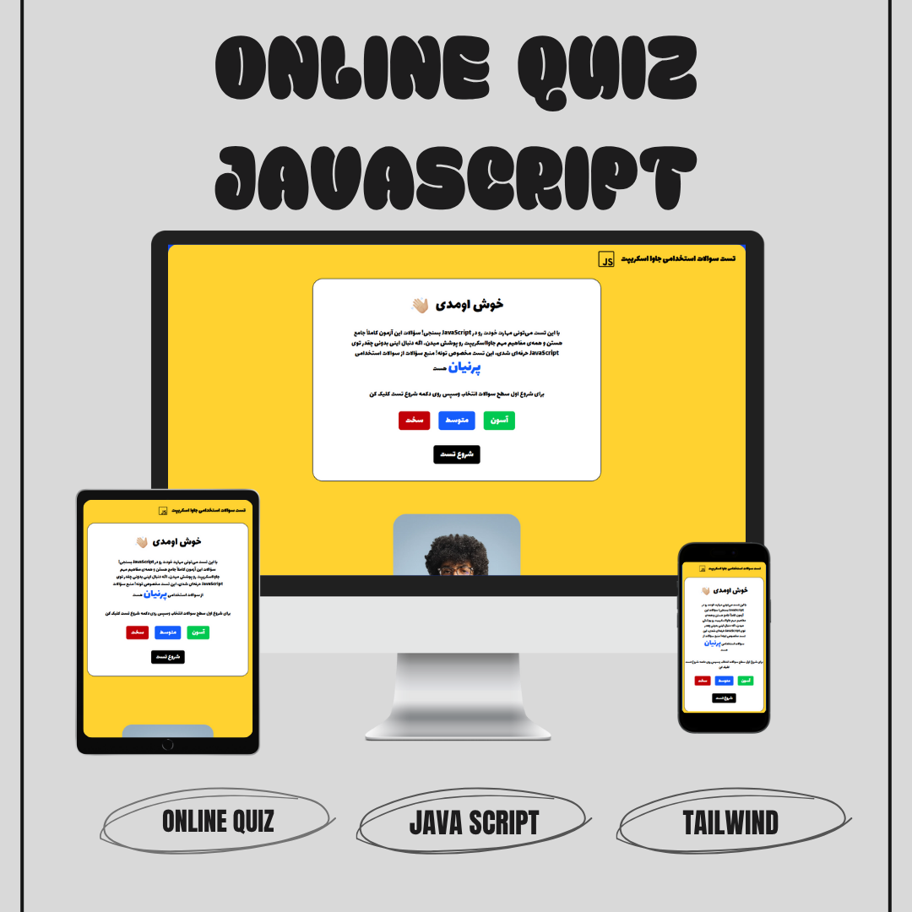
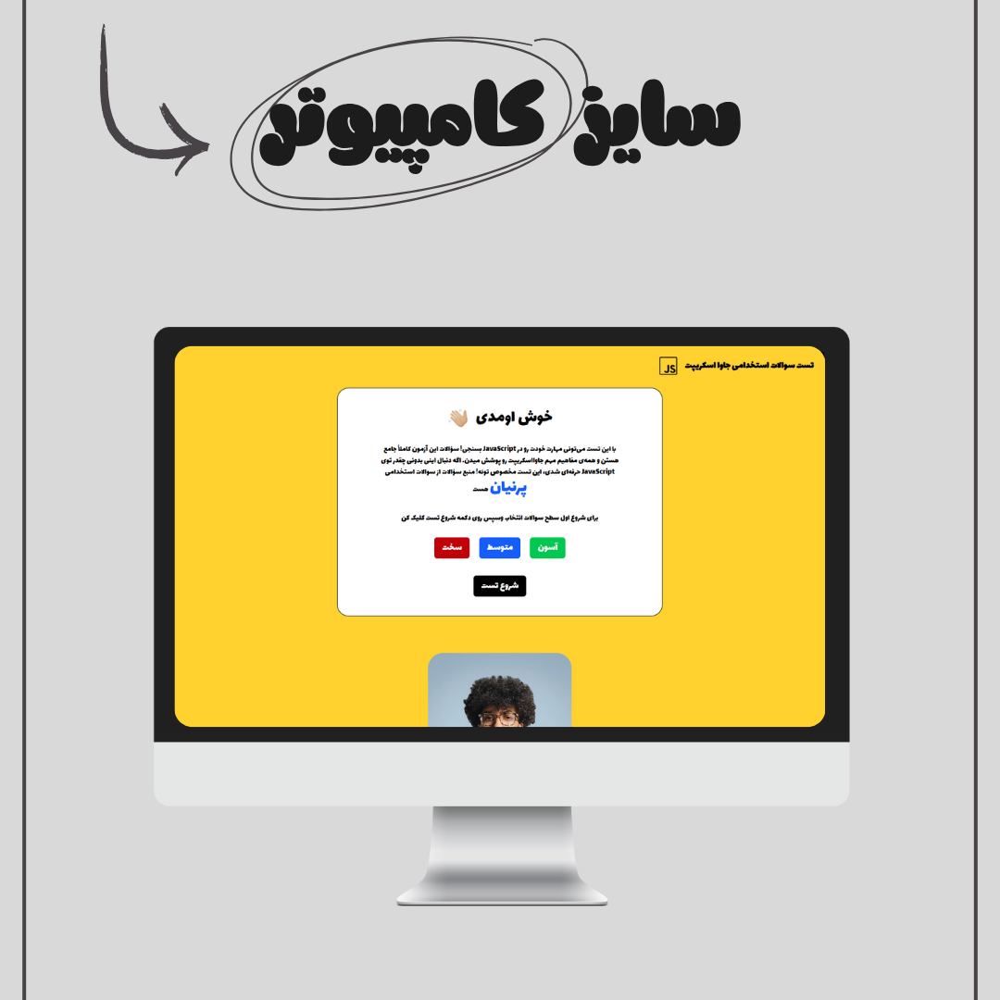
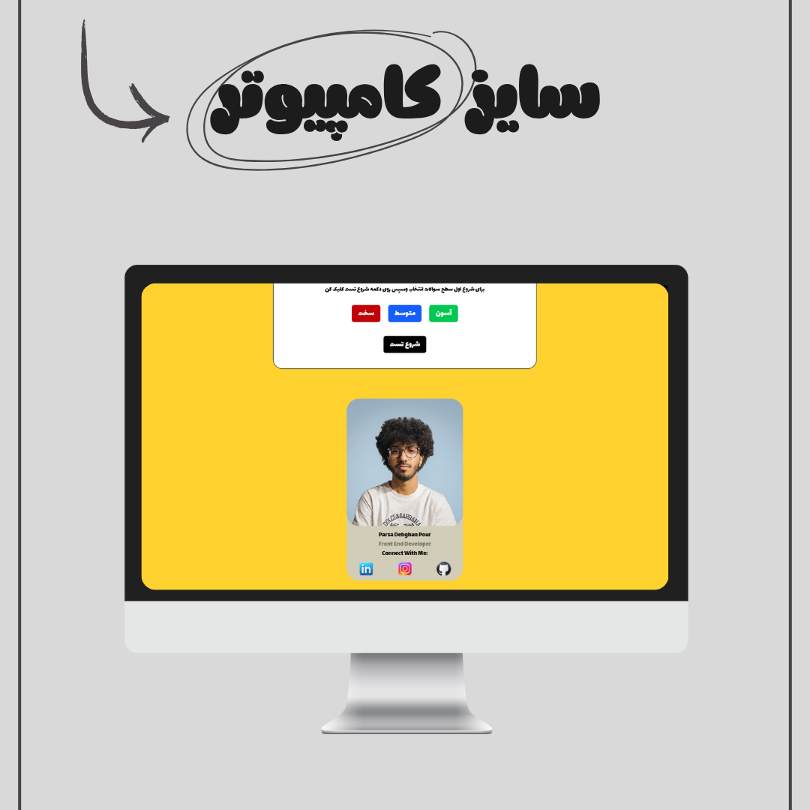
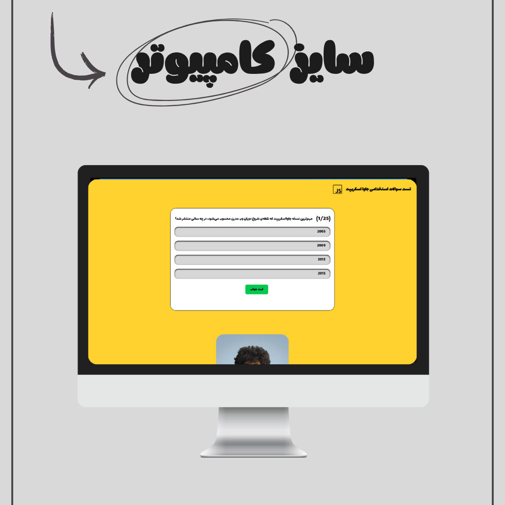
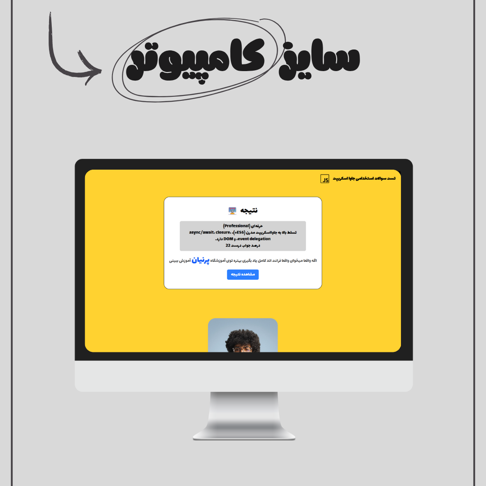

# آزمون  آنلاین سوالات استخدامی مصاحبه جاوا اسکریپت

یک آزمون آنلاین ساختم بر سوالات استخدامی جاوا اسکریپت آموزشگاه پرنیان میتونید بسنجید جاوا اسکریپت رو چقدر بلدید و اینکه 3تا سطح داره :

آسان = 25 سوال

متوسط = 50 سوال

سخت = 100 سوال

و در آخر برای مشاهده نتیجه کلیک میکنید و تعداد سوالات درست که زدید و سطحتان رو میگه

امیدوارم استفاده کنید و لذت ببرید و خوتون رو بسنجید

---

## 📅 Project Date | تاریخ ساخت  
**Octobr 31, 2025 | 9 آبان 1404**  

## 🔧 Tech Stack | تکنولوژی‌ها  
- **HTML5** – semantic markup  
- **CSS3 & Tailwind CSS** – responsive styling  
- **Vanilla JavaScript** – core functionality & interactivity  

---

## ✨ Features | ویژگی‌ها  
- 🎨 **Analyze your knowledge about JavaScript**  
- 🌓 **Multiple Difficulty Modes:** Easy, Normal, Hard  
- 📱 **Fully Responsive** (Desktop, Tablet, Mobile)  
- ⚡ **Smooth Animations** powered by Tailwind CSS utilities  

---

## 👨‍💻 Developed By  
**Parsa Dehghan Pour Farashah**  

## 🔧 Project Mentor  
[@parsa_ghorbanian_web](https://www.instagram.com/parsa_ghorbanian_web)  

---

## 🔗 Live Demo  
[👉 Try the java Script Quiz](https://parsa-farshah.github.io/quiz-JavaScript/) 

---

## 📸 Screenshots  
### 🌟 Overview  
  

### 💻 Desktop View 
  

### 💻 Desktop View 
  

### 💻 Desktop View 
  

### 💻 Desktop View 
  

---

## 📲 Connect with Me  
- 📸 Instagram: [@parsa_dehghanpour_dv](https://www.instagram.com/parsa_dehghanpour_dv)  
- 💼 LinkedIn: [Parsa Dehghan Pour Farashah](https://linkedin.com/in/parsa-dehghan-pour-farashah-85ab04250)  
- 💻 GitHub: [parsa-farshah](https://github.com/parsa-farshah)  
- 📺 YouTube: [@FrontEndFresh](https://youtube.com/@frontendfresh)  
- 📩 Email: parsafarashah2002@gmail.com  
